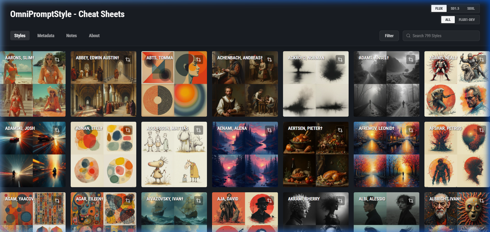
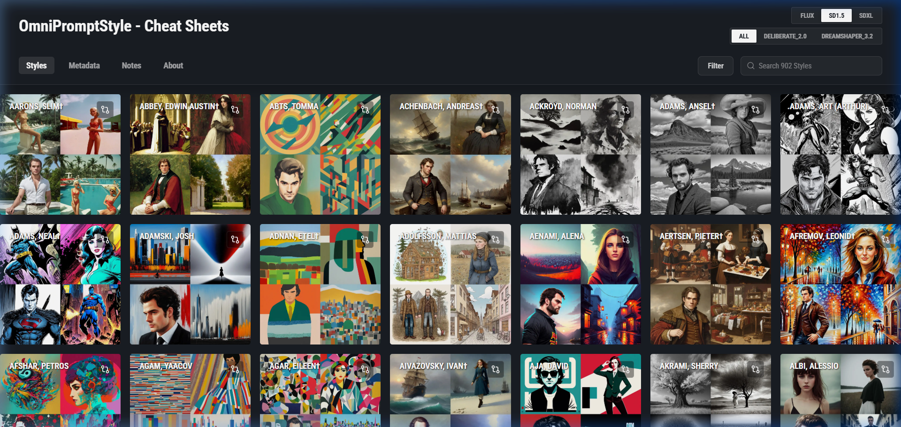
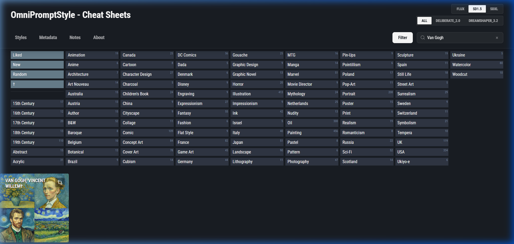
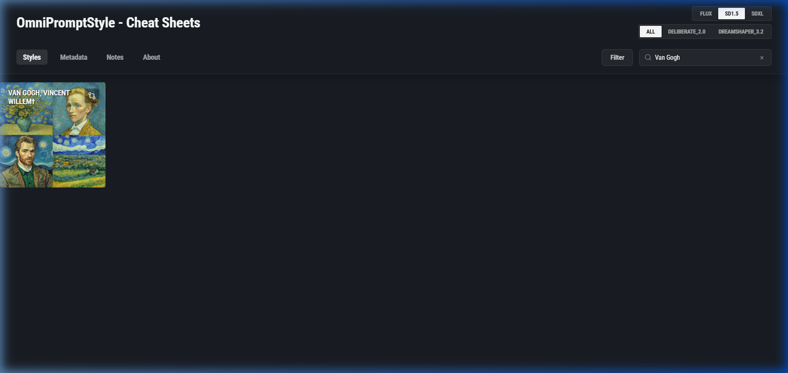
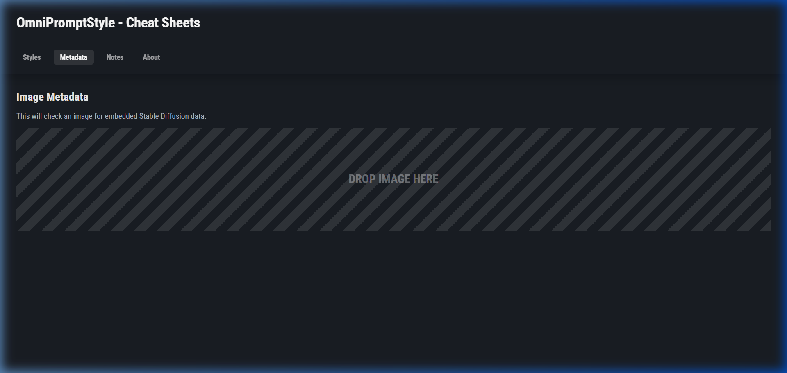
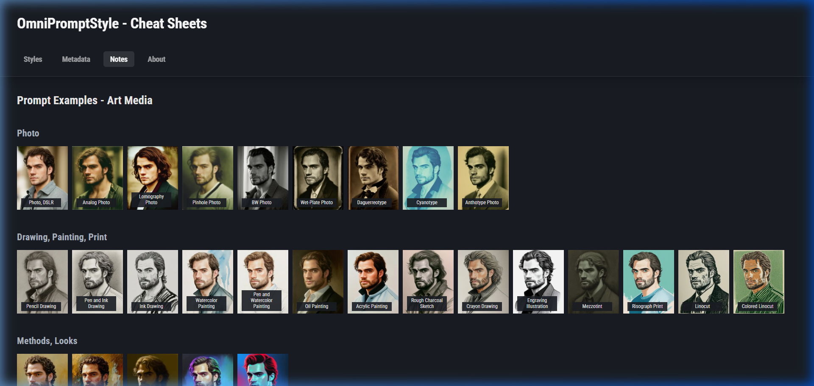
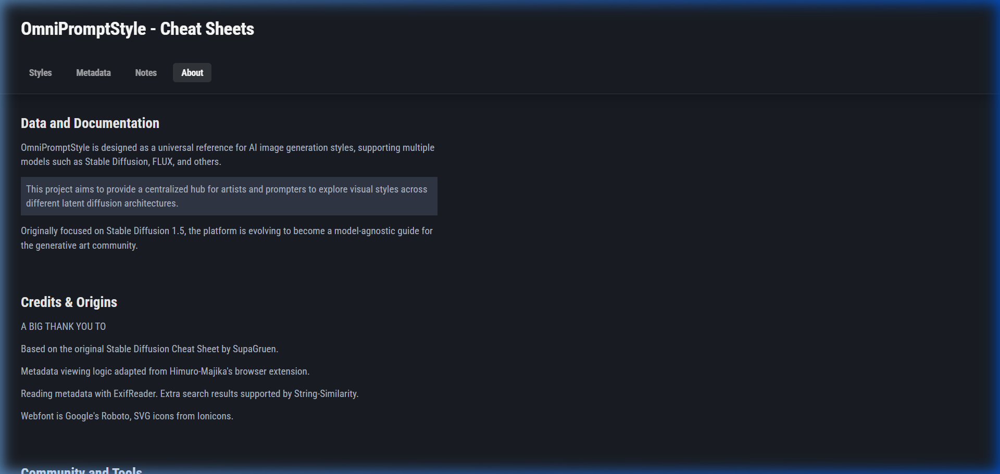

# OmniPromptStyle - Cheat Sheets



OmniPromptStyle is a comprehensive visual cheat sheet and reference guide for Stable Diffusion. It helps AI artists and prompt engineers discover, compare, and understand how different models react to hundreds of distinct art styles and artist aesthetics. 

**Note on Image Generation:** The images showcased in this database are purely the result of an automated **ComfyUI workflow** and are **not manually curated or verified**. They are generated and provided "as-is" simply to give you a broad, unedited idea of whether a given AI model actually knows the artist and how well it adheres to their specific aesthetic.

## 🌟 Key Features

### 🎨 Massive Style Library
Browse through a meticulously curated collection of nearly 800 distinct styles and artists. Each entry is visually represented with 4-grid examples across different models to give you a clear idea of the aesthetic impact.



### 🔍 Powerful Filtering & Search
Easily find exactly what you're looking for. The application includes a versatile search bar and a robust filtering system. Filter styles by medium (Photography, Illustration, Painting), genre (Cyberpunk, Fantasy, Horror), or specific techniques (Charcoal, Watercolor, Oil).



### 🤖 Multi-Model Comparison
The core value of this project lies in observing the varied responses of different models to identical artist prompts. By leveraging the automated ComfyUI workflow, OmniPromptStyle systematically generates and compares style examples across different Stable Diffusion architectures, allowing you to easily toggle between:
- SD 1.5
- SDXL
- Flux (FLUX1-DEV)



### 📊 Image Metadata Extractor
A built-in utility to inspect the metadata of your generated images. Simply drag and drop an image to reveal the hidden Stable Diffusion generation parameters (prompt, negative prompt, seed, steps, etc.) embedded within the file.



### 📝 Prompting Notes & Tips
A dedicated section providing practical prompting advice, syntax tips, and examples for different art forms like photography, drawing, and painting to help you craft better prompts.



## 🚀 Getting Started

### Prerequisites

Ensure you have the following installed on your system:
- [Node.js](https://nodejs.org/) (v18 or higher recommended)
- npm (comes with Node.js)

### Installation

1. **Clone the repository:**
   ```bash
   git clone <your-repository-url>
   cd StableDiffusion-CheatSheet
   ```

2. **Install dependencies:**
   ```bash
   npm install
   ```

### Running the Application Local

1. **Start the development server:**
   ```bash
   npm run dev
   ```

2. **Open your browser:**
   Navigate to `http://localhost:5173` (or the port specified in your terminal) to view the application.

### Building for Production

To create an optimized production build:
```bash
npm run build
```
The compiled assets will be placed in the `dist` directory, ready to be hosted on any static file server.

## 🛠️ Tech Stack

This project is built using modern web technologies:
- **React 19:** For building dynamic and responsive user interfaces.
- **Vite:** Next-generation frontend tooling for incredible speed.
- **TypeScript:** For type-safe code and better developer experience.
- **Tailwind CSS:** For rapid, utility-first styling.
- **React Router:** For smooth client-side navigation.
- **Lucide React:** For clean, scalable iconography.

## 📄 Scripts included

- `scripts/check_orphan_images.js`: Run `node scripts/check_orphan_images.js` to find images in your image folders that are not referenced in the `artists.json` database.

## ℹ️ About

This project was created to provide a visual and searchable database of styles generated through an automated ComfyUI workflow. Its primary goal is to help AI artists and prompt engineers systematically observe, document, and compare how different models (SD 1.5, SDXL, Flux) react to the exact same artist prompt. It acts as an invaluable reference tool to eliminate guesswork when trying to achieve a specific artistic vision across different generative models.

### Acknowledgments
First and foremost, a massive thank you to [SupaGruen](https://github.com/SupaGruen/StableDiffusion-CheatSheet) for creating the original project architecture and providing the foundational SD 1.5 generations. This project originated from their incredible work.

A special thanks to the creator of [FLUX-Style-CheatSheet](https://github.com/andygock/FLUX-Style-CheatSheet) for generating all the FLUX styles that are featured in this database.


